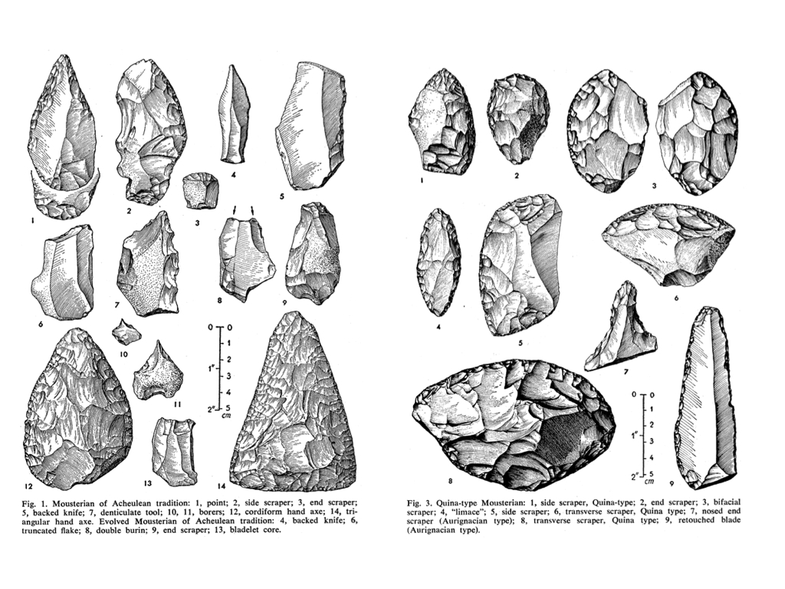

> *Before writing, the hand was used principally for making and the face for language, but with the invention of writing the balance between the two was restored.*\
>> -André Leroi-Gourhan, *Gesture and Speech*

Technology and Technique in the Mousterian Debate
==================================================

Illustrated here are two groups of stone tools manufactured by a Neanderthal culture known as the Mousterian, estimated to be anywhere between thirty and three-hundred thousand years old.  The group of tools on the left includes heart-shaped handaxes, knife edges with smoothed hand holds, a number of small borers made of flint, and ridge-faced scrapers described as "denticulate" for their tooth-like structure.  On the right, we have a greater number of side-scrapers with a single working edge, a more uniform style of retouching that resembles overlapping fish scales, and a painstakingly formed blade usually associated with the later industries of anatomically modern humans.  These tools, all of which were excavated in the 1950s from the same site in the southwest of France, occasioned one of the most famous debates over the study of cultural transmission through the archaeological record.  At a time before the development and influence of chronometric techniques like radiocarbon dating that would allow later paleoarchaeologists to definitively order these artifacts in time and space, the Mousterian debate centered on the question of how we can extrapolate history from the formal properties of a technical object.

For François Bordes, archaeologist and sometime science fiction writer, formal differences in "lithic," or stone, artifacts are evidence of distinct cultures that held shared traits.[^1]  In classifying groups of tools with shared morphological characteristics (the above representing only two of the four groups in his taxonomy), archaeologists could identify unique populations that existed at different moments in time.  Thus, in this "phylogenic interpretation" of artifacts, technology provides evidence of the cognitive evolution of hominid species.^[@bordes_mousterian_1961]  Bordes's approach was revolutionary, as it was one of the first that rejected teleological models of evolution moving from the simple to the complex.  His taxonomy of the Mousterian industry showed that there was no definitive "progress" from one group of tools -- and thus cultural groups -- to the other, with some complex artifacts preceding cultures that manufactured simpler stone tools.  At the same time, Bordes's direct mapping of technological evolution onto biological evolution unseated the importance of anatomically modern humans and their emergence in the archaeological record by showing the great diversity and complexity of Neanderthal cultures, a species whose cognitive capacities were previously thought to be relatively elementary.[^2]

[^1]: In addition to serving as Director of the Laboratory of Quaternary Geology and History at the University of Bordeaux, Bordes was a renowned science fiction author whose six novels and seven stories (published under the name Francis Carsac) are among the best regarded works in the reemergence of French science fiction after World War II.  For an his essay on science fiction set in the paleolithic, see @carsac_science_1959, translated and available online at <http://www.trussel.com/prehist/bordese.htm>.
[^2]: The Mousterian industry (later classified as the third of five "modes" of paleolithic technology in Grahme Clark's influential *World Prehistory: A New Outline* (@clark_world_1969)), is gradually beginning to take on greater importance in evolutionary archaeology.  Until recently, Mode 4 technologies were seen as the definitive moment in the emergence of modern human behavior, what archaeologists call "behavioral modernity."  Found in Europe during the Upper Paleolithic period, this regionally specific "Aurignacian culture" of anatomically modern humans is gradually being replaced in evolutionary significance by the much more wide-ranging Mousterian culture of the Neanderthals.  Robert Foley and Marta Mirazon Lahr point to the multi-stage complexity of Mousterian tool production, which involved the preparation of a stone core prior to flaking off pieces for the final shaping (known as the Levallois technique).  In this sophisticated operational sequence, stones "become the template from which diversity can be produced rather than the end product in themselves.  \[...\]  With Mode 3 we see something that begins to approach the variation we would associate with modern cultural behavior, and its appearance may be related to other substantive changes in behavior."  @foley_mode_1997. See also @foley_stony_2003

For the younger American archaeologist Lewis Binford, whose work helped inaugurate the New Archaeology movement of the 1960s, Bordes's phylogenetic approach took far too many liberties in extrapolating definitive cultural characteristics from the morphology of artifacts.  Instead, Binford encouraged a seemingly more pragmatic approach, one focused on the functions that each of these tools might have served.  Binford's interpretation was based on a processual understanding of culture:  an unfolding negotiation of groups, artifacts, and environments rather than a static set of shared traits.^[@binford_archaeology_1962.  Bruce Trigger provides a lucid intellectual history of the New Archaeology, processualism, and postprocessualism in @trigger_history_2006]  Defining culture as an "extrasomatic means of adaptation for the human organism," Binford is here not far from Bernard Stiegler's increasingly influential theorization of technics as "a process of exteriorization, [...] the pursuit of life by means other than life."^[@stiegler_technics_1998, p. 17]  Binford's "functional interpretation" saw tools as adaptive markers that existed in complex relationships with new environmental demands and changes in social organization.  Denticulate tools used for butchering animal carcasses or side scrapers for shredding plant materials might take on a different form when a population encountered a new species moving into their region.  Similarly, if that group experienced an environmental change or migrated to a different terrain, they may have to fashion their tools out of very different raw materials.  Thus in Binford's functional interpretation, the types of histories one can infer from the archaeological record are manifold.^[For more on the Mousterian debate, see @wargo_bordes-binford_2009]

The Mousterian debate reveals the complexity of how we narrate the many lives of technology:  the tasks to which our tools are put, the expanded ranges of action and forms of expression they enable, the cohesion and succession of sociocultural traditions, and how we resurrect such forms of subject-object interaction from history.  Bordes provided a model by which we can begin to think about successive paradigms of techn-ology in its most literal sense--as a thinking on and through tools--while Binford's approach encouraged a historicist acknowledgement that everything we know about the past of tool use is based on extrapolation, especially when it comes to prehistory.

[brief intro to media archaeology, and what intellectual history / tradition of archaeology has to offer]

* * * * * * * * * * *  

stemming from Foucault's archaeology of knowledge and power, the actualization of "the archive", an exploration of the conditions under which a certain statement or thought becomes possible, an excavation of how things are organized in order to produce knowledge.

historical a priori:  "a condition of reality for statements" (@foucault_archaeology_1969, 127).

archive:  "the law of what can be said, the system that governs the appearance of statements as unique events."

archaeology:  "The never completed, never wholly achieved uncovering of the archive forms the general horizon to which the description of discursive formations, the analysis of positivities, the mapping of the enunciative field belong.  The right of words -- which is not that of the philologists -- authorizes, therefore, the use of the term *archaeology* to describe all these searches.  This term does not imply the search for a beginning; it does not relate analysis to geological excavation.  It designates the general theme of a description that questions the already-said at the level of its existence: of the enunciative function that operates within it, of the discursive formation, and the general archive system to which it belongs.  Archaeology describes discourses as practices specified in the element of the archive." (@foucault_archaeology_1969, 131)

The history of ideas, which for Foucault entails "shady philosophies that haunt literature, art, the sciences, law, ethics, and even man's daily life . . . themes that are never crystallized in a rigorous and individual system", none of this could ever "attain the form of scientificity."  "the history of alchemy rather than chemistry, of animal spirits or phrenology rather than physiology, the history of atomistic themes rather than physics" (@foucault_archaeology_1969, 136)  The presence of these "shady" discourses -- beliefs, imaginaries, incorrect theories -- will be useful as we go along in a thoroughgoing account of what it is to think through a tool.

[Perhaps to the chagrin of Foucault "the analysis of sub-literatures, almanacs, reviews and newspapers, temporary successes, anonymous authors" is one of the fields that digital methods promises to explore.]

This isn't to ask for any sort of "scientificity" in its own right, especially when archaeologists are continuously calling into question notions of positivism in their work, instead preferring to view their research as 

* * * * * * * * * * * 

Of course, these questions of interpretivism have since been simplified by chronometric techniques that lend greater accuracy to the dating of objects.  Bordes and Binford wrote just before the development and influence of radiocarbon dating, which allowed later paleoarchaeologists to definitively order their artifacts in space and time.[^1]  Unless researchers like Bordes and Binford extracted paleolithic tools from neatly stratified layers in the sediment, thus lending some sort of temporal order (which was exceedingly rare), they strung artifacts together in a historical sequence by extrapolating from form.

[^3]: See @foley_stony_1997, p. 5-6 on the ways in which the rise of chronometric dating techniques influenced a move toward functional interpretations of artifacts.  "Dating developments, such as the radiocarbon method, were important as they showed that the appearance of similar artefacts in different parts of the world was not consistent with diffusionist models.  With ideas drawn from both ecology and cultural anthropology which suggested that material culture and economic systems reflected functional demands, archaeolgoists preferred to explain similarities in form in terms of local convergence, adaptation to local raw material availability and autochthonous developments, and more generally as complex systems."

But to say that radiocarbon dating effectively solves the Mousterian debate by allowing the paleoarchaeologist to declare that, in fact, this side-scraper is exactly 43,000 years old, is to overlook the material vicissitudes of extracting a technical object from the sediment and abstracting it from all of its Heideggerian involvement-relationships.[^1]  Herein lies the importance of understanding the technical object not just as a tool, but as a complex of traces revealing the preferences, routines, and styles that form the basis of individual and social behavior.  In extracting and abstracting these artifacts, we experience what Wolfgang Ernst describes as "the hard-edged resistance of material objects that undo historical distance simply by being present."  No matter how finely tuned the scientific instrument, the accuracy of archaeological evidence is always inflected by "the human eye, confronted with an irritating material presence of the past, which by definition should be absent, [a situation that] immediately confounds evidence with magic."^[@ernst_media_2011, p. 249]

[^4]: Furthermore, radiocarbon dating is far from exact, accurate only within the last 50,000 years.  "Analysis of trapped gases in fine annual layers in ice cores from Greenland has shown us that the ratios of the different isotopes of atmospheric carbon, ratios that are so essential to radio-carbon dating, are not constant but vary in different periods. Humans' greater fuel use over time is partly to blame, but natural variations in atmospheric carbon occurred even in remote periods. Calibration curves, which are being constantly updated, allow labs to generate ever more accurate dates. Even so, radiocarbon dating does not offer the literal precision provided either by human calendars or by the natural calendars embedded in the growth rings of trees, in coral, or in the very fine layers that may form at regular intervals at the bottom of lakes or oceanic basins. Radiocarbon dating describes a probable date, expressed in intervals of centuries or millennia and hedged about with a margin of error."  @shryock_deep_2012, p. xv.

Magic, when it is spoken of in relation to technology, usually implies a kind of awe in the face of inscrutable complexity.  According to Arthur C. Clarke's so-called third law, "any sufficiently advanced technology is indistinguishable from magic."^[@clarke_hazards_1962, p. 36]  But it is important for us to remember that there is a very different form of magic about tools as simple as the denticulate side-scraper, one that has everything to do with legibility.  These artifacts compel speculation on the irremediable texture of habits and techniques that have long since been forgotten or absorbed into other forms of technical expertise.  Despite their alien appearance and their improbable survival from a world so different from our own, these tools (like any other) almost seem to reach out and grasp us, whispering of how they are to be used.  This is what we might call technology's ontological magic:  how we come to understand what a tool is and what it's good for.

While the Mousterian debate reveals what's at stake when thinking about technology, I want to suggest that it also dramatizes what it is to think through technology.  There is something of this paleoarchaeological magic evoked every single time we pick up a tool.  A delimited set of affordances branches off from the contours of the individual tool (e.g. torque, storage, amplification), but it is never enough to simply begin and end here.[^1]  This purposive model must always unfold into a range of preferences, routines, traditions, and styles.  Thus, the dialectic at the core of the still unresolved Mousterian debate -- between cultural tradition or functional adaptation, technology or technique -- is played out in the ways we think through a problem using the potential grammar of material solutions, whenever we decide to push or pull, attempt to decipher a manual, or prepare to teach a new method.  The "operational sequence" of any technical interaction, as the French archaeologist André Leroi-Gourhan calls it, consists in an assemblage of material and non-material components:  "Techniques involve both gestures and tools, sequentially organized by means of a 'syntax' that imparts both fixity and flexibility to the series of operations involved.  This operating syntax is suggested by the memory and comes into being as a product of the brain and the physical environment."^[@leroi-gourhan_gesture_1993, p. 114]  In this sense, the precise contours of technical interaction have the potential to be wholly unique every time, with each instantiation of a particular technology or technique being subject to an alchemical mixture of cultural determinants and individual predispositions.  The tool cannot simply be reduced to the culture from which it emerged, nor can it be understood solely through the logic of functionality.  Between the technology and the technique, there is a unique "syntax" negotiated by each of us, drawing upon the capacity to read the range of practical use off the shape of a tool, to imagine a series of possible or desirable outcomes, and to make those intangibles material.

[^5]: "Zahlreiche Technikgeschichten kummern sich kaum um die Gebrauchsfrage oder setzen vielmehr stillschweigend voraus, dass sich die Verwendung einer Maschine ganz selbstverstandlich aus ihren technischen Eigenschaften ergibt."  /("Scores of technological histories pay little attention to the question of their use, or rather, they take it as a matter of course that the use of a machine arises organically out of its technical properties."/)  @flichy_tele_1994, p. 13.  For some thoughts on why a history of "technology-in-use" is needed, see @edgerton_innovation_1999, 111-136.  Important for our purposes is Edgerton's eighth thesis:  "Invention and innovation rarely lead to use, but use often leads to invention and innovation."

But if we continue in this vein, following Heidegger's insight that "the essence of technology is by no means anything technological," what then should constitute our object of study?^[@heidegger_question_1977, 4.]  Does a handaxe crafted from a previously prepared (i.e. "Levallois") stone core constitute a technology or a technique?  What about a telegraph key designed to be grasped in the palm, its sounder struck with the thumb?  Or a touchscreen that allows a pinching gesture to be translated into a change in the size of a digital image?^[Apple is currently engaged in ongoing litigation over the right to patent gestures like pinch-to-zoom.  @gardiner_can_2008]  The relationship between a tool and its affordances has been tackled from a number of angles, and many of these approaches will be drawn upon in what follows.  But very few studies have been willing to take up the imaginary or speculative dimensions necessary to any instance of technical interaction.  Everyone picks up a tool in the subjunctive mood:  what does this make possible that wasn't before?  How hard do I have to swing it?  How can I apply this to my concerns?  Even, why doesn't it work?  As I hope it will become clear, a fuller understanding of these imaginative dimensions is important not only for the everyday tools we have at hand, but for historical and future technologies as well.  Prehistoric stone tools, dead media, and shiny new devices feel like magic because they exceed the contextual frameworks within which we would normally use them while at the same time providing a material trace of what the contours of that use might look like.  In this way, technical literacy evokes specters of the past and the future.

New Media and Cognition
========================

The paleoarchaeological idea that changes in technology can help us to register evolutionary shifts in the cognitive capacities of hominids is one that has begun to enter popular consciousness, thanks to contemporary conversations on gadgetry.  While it once referred to the small, the trivial, or the indeterminate, today, the word gadget is almost entirely associated with digital media and portable electronics:  technologies that are seen to have momentous effects on social life and cultural production.  Gadgets like smartphones, tablets, and GPS receivers, say the pundits, are fundamentally altering the ways we read, communicate, and even think.  This shift has ramifications for logic ("Over the past few years I've had an uncomfortable sense that someone, or something, has been tinkering with my brain, remapping the neural circuitry, reprogramming the memory. My mind isn't going--so far as I can tell--but it's changing. I'm not thinking the way I used to think"^[@carr_is_2008. Later developed into the full-length book, @carr_shallows_2011]), memory ("the medium has created an unremitting low-intensity neural disquiet that we feel only the medium can allay -- even though it cannot, never has. But it is an attribute of the Internet to activate in me, and maybe in all its users, a persistent sense of deferred expectancy, as if that thing that I might be looking for, that I couldn't name but would know if I saw, were at every moment a finger tap away"^[@birkerts_room_2011]), and even spatial reasoning (a recent editorial in *The New York Times* by the cognitive scientist Julia Frankenstein reports that the nature of spatial interactions -- whether mediated through verbal directions, a map, or GPS technologies -- physically alter brain structures^[@frankenstein_is_2012]).  "I miss my pre-internet brain," reads one piece of installation art by Douglas Coupland that has since circulated online as an image macro.^[Coupland's piece was exhibited at Art Labor, Shanghai, in September 2012. <http://blog.micheletravierso.com/i-miss-my-pre-internet-brain-douglas-coupland>.]

[transition?]

This approach may seem familiar to those who follow the attempts now being made in media studies to answer questions about how technology evolves.  After decades of denigrating the metanarratives of (among others) Marshall McLuhan, Lewis Mumford, and Vilem Flusser -- theorists who sought to construct a deep history of technological paradigm shifts, each of which culminated in projected futures of (respectively) the global village, neotechnic phase, or telematic society -- models of cultural evolution (or "evolutionary epistemology") have begun to creep back into theories of media and technology.  Excavational metaphors now abound in media studies and the digital humanities:  media archaeology, data mining, the "forensic imagination," and "visualizing the nineteenth century literary genome."^[@kirschenbaum_mechanisms_2008. @jockers_computing_2012.]  Man the Toolmaker, a notion prevalent among paleoarchaeologists in the mid-twentieth century that connected the emergence of the human with the beginnings of tool use (hence Mary and Louis Leakey's naming of homo habilis, "handy-man," in distinction to homo sapien, "knowing human"), has taken on a new significance in the age of digital media and mobile computing.  As a means of assessing the changes wrought by new technologies, it has led to a resurgence in the concept of technogenesis among media theorists:  the idea that hominids have co-evolved with tools in a highly complex feedback loop between the biological and the technical.  For proponents of the theory of technogenesis, "it is impossible to define the human as either a biological entity (a body or species) or a philosophical state (a soul, mind, or consciousness), because our 'nature' is constituted by a relation to technological prostheses."^[@bradley_originary_2006, 78]  As David Wills writes, "there is technology as soon as there are limbs, as soon as there is any articulation at all.  As soon as there is articulation, the human has rounded the technological bend, the technological turn has occurred, and there is no more simple human.  Which, for all intents and purposes, means that there was never any simple human."^[In acknowledging "the originary mechanics at work in the evolution of the human species," Wills clarifies that "This is not to replace the organic with the mechanical but to argue against any rigorous purity of either."  @wills_dorsality_2008, 5-6.]

While many proponents of technogenesis write on the scale of several millennia, others espouse the theory as a way to speak to the specificities of digital technology.  Some media theorists take the evolutionary model quite literally, as does Katherine Hayles when she writes of "the changes in human attitudes, assumptions, and cognitive modes associated with digital media."[@hayles_how_2012, 85.]  But if the digital revolution not only recapitulates the evolution of technology but intensifies it, as Hayles would have it, the question becomes:  is it possible for an individual to actually feel the pressure of evolutionary change?  Can what previously occupied vast swaths of evolutionary time now be condensed into the life of an individual organism, or even further, a particular moment of technological interaction?

On one level, the answer is: certainly not.[^1]  No one fully understands the mechanism behind the evolutionary divergence of modern humans from species who didn't use tools, and any attempts to understand what the next great evolutionary leap may be (or has been) -- such as Leroi-Gourhan's amazing speculations in 1962 on the rise of automation and "audiovisual media" -- are speculative at best.[^2]  Moreover, many media theorists writing on the idea of technogenesis in relation to contemporary media technologies employ ideas that are highly contentious and even completely outmoded among paleoarchaeologists today.  For instance, many proceed from the starting point that it was the emergence of bipedalism that first allowed tool usage, citing a line of Darwin's speculating that walking upright freed the hands to manipulate objects and carry food over long distances.[^3]  This idea is not only problematic because it is now generally accepted that our hominid ancestors were bipedal millions of years before they began making tools[^4], but because tools have been observed in use with a wide variety of non-bipedal animal species, including chimpanzees, who have been shown by primatologist Andrew Whiten to possess "the capacity for cultural transmission."  That is, "experimentally introduced technologies will spread within different ape communities," and individual chimpanzees show "a capacity to acquire local variants of the technique."[^5]  Research on the "cultures" of animal tool use significantly complicate claims that technology marks the distinctive specificity of the human.[^6]

[^6]: Ian Tattersall argues that although the emergence of new kinds of tools does indicate increased cognitive complexity, they do not correspond with new kinds of species, which throws a kink in the technogenesis theory:  "But the fact that the first stone tools -- the first step in an epic transformation -- were made by creatures whom we can -- with reservations -- characterize as "bipedal apes," inaugurates a pattern that we will see recurring repeatedly over the entire span of hominid evolution: new technologies (reflecting new and more complex behaviors) do not tend to be associated with the appearance of new kinds of hominid. It was old kinds of hominid that started to do new things, even though those new things always seem to indicate a step up in cognitive complexity."  @tattersall_masters_2012, Kindle loc 1270.  For a critique of this approach that links stone tool making to the cognitive capacity for language, see @wynn_tools_1991, 191-206.
[^7]: Leroi-Gourhan writes:  "Not having to 'think with one's fingers' is equivalent to lacking a part of one's normally, phylogenetically human mind. Thus the problem of regression of the hand already exists today at the individual if not the species level. [...] manual imbalance has already partially destroyed the link that used to exist between language and the aesthetic image of reality. It is not a matter of pure coincidence, as we shall see, that nonfigurative art is flourishing at the same time as "demanualized" technicity."  @leroi-gourhan_gesture_1993, 255.
[^8]: Hayles writes:  "Walking on two legs freed the hands, and the resulting facility with tools bestowed such strong adaptive advantage that the development of bipedalism was further accelerated, in a recursive upward spiral that Andy Clark calls 'continuous reciprocal causation." @hayles_how_2012, 10.
[^9]: "What made the intellectual leap to stone tool making is not something we can hazard with any confidence at this point." @tattersall_masters_2012, Kindle loc. 524 & 1267.  The most commonly accepted date of the emergence of stone tool use is 2.6 million years ago, with recent evidence according to research by McPherron et al., suggesting that this origin point may be pushed as far back as 3.4 Ma, albeit with stones that had been most likely naturally shaped.  However, according to Lovejoy, bipedal hominids emerged anywhere between 4.2 - 3.9 million years ago.  @mcpherron_evidence_2010.  @lovejoy_evolution_1988.
[^10]: @whiten_conformity_2005.  Whiten, discussing why chimpanzees don't have a cumulative culture (i.e. knowledge that accumulates and progresses across generations, rather than merely the sharing of techniques among individuals), speculates that cultural complexity might not be located in the cognitive capacity of the individual, but in collective cultural contexts.  Complexity may reside in groups, not individuals:  "An alternative hypothesis is that the important differences lie in the cognitive complexity of the relevant cultural contents: the capacity to knap an Acheulian biface, for example, as much as the capacity to copy the skills of others." @whiten_second_2005
[^11]: Following this line of thinking, media theorist Dominic Pettman critiques the way that technogenesis theory equates "technics with hominization," thus leaving out all of the ways in which "nonhuman animals may engage with what Graham Harman calls 'tool-being.'" @pettman_human_2011, Kindle loc. 2200.

And yet on another level, there is something to the idea that an encounter with a new technology causes an immediate reorientation in the ways we make sense of the world.  The gadget-conscious of today frequently remark that touching the latest Apple product is like "holding the future in your hands," as if the iPhone were the next iteration of the 2001: A Space Odyssey monolith:  a sleek black box we couldn't possibly understand but that somehow makes us smarter the instant we touch it.[^1]  In this mythical explanation of human origins that falls into the gap of Kubrick's famous match cut from the bone club thrown into the air to the spaceship gracefully floating through outer space, we are simply remade by the tool the moment what might be done with it becomes clear.  Setting aside questions of cognition and neurophysiology, I am interested in finding a language for this kind of fictive energy so that we might be able to register and historicize the perceived pressures of techno-logical change.  Despite the fact that we cannot say in any sense whether we are biologically "evolving" with digital media, what might it instead look like to track an evolution in the imaginative dimensions constitutive of all technical interaction?

[^12]: "Like holding the future in your hands" is a phrase that circulated in a lot of forums and reviews surrounding the release of Apple's first iPhone, but it seems to have originated with a blog post by @powazek_like_2007.

Epistemological Reverse Engineering
====================================

Epistemologies of media technology have been taken up from a number of different angles.  Contemporary German media theorists, working off Friedrich Kittler's decisive pronouncement that "media determine our situation," are developing conceptual vocabularies to describe the space between technology and the subject.[@kittler_gramophone_1999. For a comprehensive treatment of Kittler's theory of media, see @winthrop-young_kittler_2011.]  One conversation revolves around the idea of Kulturtechniken, or the underlying "cultural techniques" that are older than the theories or systems that are eventually generated from them.  For instance, people made marks before there was an alphabet, and individuals sing or hum before they have any notion of musical notation.  Bernhard Siegert:

> Once we reconstruct those operative sequences [perhaps drawing here upon Leroi-Gourhan's concept] that configure or constitute media, the latter can be explained as cultural techniques. ... The concept of cultural techniques, therefore, is vehemently opposed to any ontological usage of philosophical terms: Man does not exist independently of cultural techniques of hominization, time does not exist independently of cultural techniques for calculating and measuring time; space does not exist independently of cultural techniques for surveying and administering space; and so on.^[@siegert_cacography_2007.  The November 2013 issue of *Theory, Culture, & Society*, edited by Jussi Parikka and Geoffrey Winthrop-Young, was devoted to translations of foundational essays on the concept of Kulturtechniken.  See also *Zeitschrift fur Medien- und Kulturforschung* (Hamburg: Felix Meiner Verlag), ed. Lorenz Engell and Bernhard Siegert, volume 1 (2010), an issue on Kulturtechniken.]

A different approach emphasizes an attention to Mediengebrauche, or particular "media usages" (e.g. to compile, to skim, to arrange, to watch, to like) rather than proceeding from categories of media as defined by their contents, or from self-evident media historical epochs.^[@christians_historisches_2013]

Media archaeology is one approach with roots in German media theory that is beginning to gain traction in the American academy.[^1]  Far from the stones and bones of paleoarchaeologists, this new field of media research takes its cue from the "archaeology" of Foucault, with its critique, or discourse analysis, of the systems of power behind cultural forms.  For media archaeologists, uncovering forgotten curiosities from media history provides a unique vantage point on contemporary media cultures.  A relatively recent approach whose scope ranges from a "nascent discipline" to an "aesthetic undertaking", media archaeology is a historiographic movement that seeks to branch out from the traditional canon of media history (book -> phonograph -> cinema -> television -> Internet) in order to catalogue and make visible the forgotten paths and curiosities from the history of research and development, interaction, and speculation.^[@druckrey_foreword_2006. @gitelman_always_2006]  Here, objects like punch cards, magic lanterns and other optical toys, corporate technical reports, and even revolving doors take center stage.  In this sense, media archaeology is not merely a call to do better history, or even to revise the canon of historical objects.  Rather, as a distinct method, it has the effect of creating unexpected correspondences between habitual and historical media.

[^13]: Jussi Parikka provides an archaeology of the field itself in @parikka_what_2012.  A collection of representative essays in the field can be found in @huhtamo_media_2011.

Another sympathetic area of inquiry can be found in Platform Studies, which started with an MIT Press book series edited by Ian Bogost and Nick Montfort.  By focusing on the "underlying computer systems and how they enable, constrain, shape, and support the creative work that is done on them," scholars in platform studies contend that "it is time for humanists to consider seriously the lowest level of computing systems, to understand their relationship to culture and creativity."^[More on this series can be found at <http://platformstudies.com/>.]  The books published in the series so far are specific to gaming, with titles on the Atari, Nintendo Wii, and the Commodore Amiga.  

The work of all the above scholars informs and inspires my own study.  In analyzing the cultural history of the gadget, I hope to contribute to this larger and incredibly dynamic body of scholarship on the relationship between technology and cultural form in the age of digital media.  It is with my particular focus on the imaginary that I hope to enrich the ongoing conversation.  Scholars like Jussi Parikka and Eric Kluitenberg have written on what they call "imaginary media," a category that, in my view, deserves much further elaboration.^[The relationship between the occult, German romanticism, and optical media (especially prefigurations of television) will be explored in @andriopoulos_ghostly_2013.]  The imaginary is always embedded within a "network of material practices," as Kluitenberg puts it, and in Parikka's historical observation on the turn of the twentieth century, "the new world of science and technology was the imaginary that was often most easily affiliated with the dead, with ethereal communication between brains, and with understanding the new through such metaphoric transitions."^[@kluitenberg_archaeology_2011, 55. @parikka_what_2012, 59.]  But the precise relationship between the material and the imaginary, the circuits connecting them on the most elemental of levels, has yet to be fully explored in scholarship on media technologies.  For me, this entails a radical rethinking of what it is to use media, an activity intimately related to the the individual's imagination of -- quite simply -- making and acting.  While Kluitenberg and Parikka advocate the analysis of the imaginary on the level of vast, discursive fantasies (like telepathy and communion with the dead), I will attempt to show how "the imaginary" is every bit a product of an individual subject's experience with an individual tool, with all of the complications that those terms entail.

The turn I want to make here to *paleo*archaeology is meant to emphasize that any approach to the historiography of media cannot merely devolve into a collection of forgotten curiosities and thus a better, more complete form of history.[^1]  Instead, paleoarchaeology gives itself over to inference, to potentialities not readily available on the surface by extrapolating history from typology, by "defining the position of each element in relation to the other elements in the series," as Foucault puts it in one of his definitions of archaeology.^[@foucault_archaeology_1969, 7.]  Technical artifacts takes on a variety of forking paths, potential lives that branch off from the individual tool.  Further, these tools are treated not merely as self-sufficient pieces of evidence, but as ideational units, imaginative products of the mind and culture that produced them.  In this way, we will of course be exploring not merely fictions about particular technologies, but the constitutive fictionality of technology itself -- the way in which any technical interaction compels imaginative thought.  Paleoarchaeology's "epistemological reverse engineering"^[@ernst_media_2011, 239] of human tool use mirrors the very process it seeks to uncover:  we hold a tool and attempt to think through the contours of what it affords.

[^14]: Timothy Druckrey makes a similar point when he writes that the media archaeological approach must be "more [than] a mere cataloguing of the apparatus itself":  "[it] must constitute itself against self-legitimation or self-reflexivity ... if it is to circumvent the reinvention of unifying, progressive, cyclical, or 'anticipatory' history----even as it is challenged to constitute these very vague histories as an antidote to the gaping lapses in traditional historiography."  But at the same time, "Merely reconstituting or retrofitting 'old' media into 'new' contexts could, in this sense, only emerge as techno-retro-kitsch."  Instead, we must imagine media archaeology as "the new cartography" of cultural techniques. @druckrey_foreword_2006

While media studies has classically been interested in large scale materiality -- broadcast networks, representational frameworks, content delivery systems, power structures, transnational flows -- the emergent approaches summarized above indicate a renewed attention to materiality as a process, negotiated on the smallest of scales.[^1]  The ongoing debate in paleoarchaeology over how to interpret technical artifacts remains instructive for theorists of media.  What is the unit of analysis we are are interested in:  the technical artifact or the ideational unit that it symbolizes?  The inner structure of that artifact or the web of practices, actors, and materials that it draws together?  Hewing closely to the contours of the gadget as an object of study, I want to ask: what would a media theory of interaction look like, one in which materiality encompassed the mediation between an individual subject and object, user and tool?[^2]  What can we read off the shape of the individual artifact:  a distinct culture, unique in space and time, or the uses to which that tool can be put, with all that such usage entails?  While thus far media archaeology seems to privilege the history of vast social and technical apparatuses, a paleoarchaeology of media does not focus exclusively on the artifacts constituting these epistemes but on their techniques as well.  These techniques include not only the technical work process to which a given tool is put, but the ideas behind technologies -- fictions or memes of their efficacy, a subjunctive realm that for Leroi-Gourhan has every bit as much to do with operational sequences as do the tools themselves.  Throughout this project, I will demonstrate how fictions -- broadly understood -- play a constitutive role in the emergence of new media as socially shared systems of communication and expression.

[^15]: For an overview of emergent approaches to materiality beyond media archaeology and theories of Kulturtechniken and Mediengebrauche, see @coole_new_2010
[^16]: That is, how can we understand materiality encompassing the entire situation in which a user experiences an object or a tool?  How can materiality take technical interaction into account?

* * *

References
===========