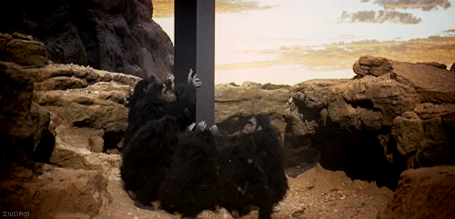

Imagine, for a moment, that you are an archaeologist from the future who has just unearthed a near perfect specimin of the early twenty-first century smartphone.  What does this artifact -- a compact assemblage of inevitably cracked glass and orifices clogged with sediment -- have to say about the person who once used it?  Stripped of all context, how can you infer something about the nature of the lost culture that produced this object, solely from its readily apparent, formal properties?

If you were able to ask some contemporaries of the device itself, they would probably explain that you were holding evidence of a turning point in the history of human cognition.  By 2013, when [over three-quarters of American adults](http://www.businessinsider.com/us-smartphone-market-2012-9) had become smartphone users, a rising chorus of notable critics and thinkers began to argue that these gadgets produce a noticeable drain, shift, modifciation, amplification, or amputation of their users' cognitive abilities.  In the same way that the multi-stage complexity of the Levallois technique for producing handaxes was argued to coincide with the emergence of "behavioral modernity", and the discovery of the wooden Schöningen spears painstakingly fashioned by Homo heidelbergensis over 300,000 years ago significantly pushed back the date at which language was thought to emerge, mobile media like the smartphone marked for these commentators a distinctive moment in which [the way we think](http://press.uchicago.edu/ucp/books/book/chicago/H/bo5437533.html) began to change.

Depending on the critic you managed to communicate with, you would hear that the presence of these devices in the everyday lives of their users had immense ramifications for [logic](http://www.theatlantic.com/magazine/archive/2008/07/is-google-making-us-stupid/306868/) ("My mind isn't going -- so far as I can tell -- but it's changing.  I'm not thinking the way I used to think"), for [memory](http://lareviewofbooks.org/article.php?id=162&fulltext=1) ("as if that thing that I might be looking for, that I couldn't name but would know if I saw, were at every moment a finger tap away"), and even for [spatial reasoning](http://www.nytimes.com/2012/02/05/opinion/sunday/is-gps-all-in-our-head.html) ("the more we rely on technology to find our way, the less we build up our cognitive maps"^[frankenstein2012]).  "I miss my pre-internet brain," reads one piece of [installation art](http://blog.micheletravierso.com/i-miss-my-pre-internet-brain-douglas-coupland) by Douglas Coupland that made its rounds as an image macro.  It felt, the argument goes, as if everyone started carrying around their own personal *2001: A Space Odyssey* monolith: a thin black slab whose inner workings we can't possibly understand that nevertheless changes the way we think the instant we touch it.

Time-traveling through experiment aside, I'm interested not only in the increasing popularity of arguments linking new media to cognitive shifts, but in their appeal to intuition as evidence:  for instance, in the claim that holding the latest Apple product feels "like holding the future in your hands."  But do inanimate objects actually influence the course of human evolution?  If so, is it possible to feel the pressure of this change within the span of a single organism's life?  Similarly, do those objects -- as they become thinner, lighter, and more powerful -- "evolve" in anything more than a metaphorical sense?  Though these questions have long remained a subtext in evolutionary theory, the history of technology, and industrial design, they are now coming to the fore as we try to account for the ways new technologies entail new patterns in our daily lives.

While it may feel anecdotally right that we are somehow very different from our pre-smartphone, pre-Internet selves, debates over the ways in which such a shift might be assessed have a long tradition in the history of archaeological thought.  Instructive for our purposes is a group of Neanderthal artifacts unearthed in the mid-1950s from the southwest of France that kicked off one of the most famous debates over the study of culture through the material record.  Manufactured by a culture now referred to as the Mousterian, these tools were uncovered at a time before the development radiocarbon dating, which would allow later archaeologists to definitively order these artifacts in time and space.  The still unresolved Mousterian debate thus centered on the question of how we can extrapolate history from the formal properties of a technical object.  Does a given tool provide information on the cognitive abilities of the culture that produced it?  Or should we focus instead on the uses to which that tool was put?  Does a Neanderthal handaxe (or a nineteenth century telegraph key, or a capacitive touchscreen) provide evidence of a distinct culture that held shared traits -- i.e., a *technology* -- or does it tell us about *technique* and the network of actors and materials the tool may have come in contact with?

But the Mousterian debate helps us to simplify the question, standing as a parable for the ways we can make arguments about culture and cognition using material objects as evidence.  Ultimately, all interpretations of material culture end up passing through the dialectic highlighted in this debate.

Here are two groups of the Mousterian artifacts as depicted in one of the earliest articles reporting on them in the journal *Science.*  At the time, these tools were estimated to be anywhere between thirty and three-hundred thousand years old.  The group the left includes distinctively heart-shaped handaxes, sharp knife edges with smoothed hand holds, a number of small tools made of flint used for boring, and ridge-faced scrapers described as "denticulate" for their tooth-like structure.  On the right, we have a greater number of side-scrapers with a single working edge, a more uniform style of retouching that resembles overlapping fish scales, and a painstakingly formed blade usually associated with the later industries of anatomically modern humans.

What's important to remember is that the grouping of these tools has been arranged entirely after the fact according to their shared formal traits.  These are two *ex post facto* genres of technology assembled by the established French archaeologist and sometime science fiction novelist François Bordes, who found all of the tools at the same site.  [MORE ON BORDES'S SCIENCE FICTION]  For Bordes, formal differences in stone artifacts are in effect evidence of distinct cultures that held shared traits.  In classifying groups of tools with shared characteristics (the above representing only two of the four groups in his taxonomy), archaeologists could identify unique pouplations that existed at distinct moments in time.  In this "phylogenic interpretation" of artifacts, tools thus provides evidence of the cognitive evolution of the human species.  The more elaborate the artifact, the more complex the culture that must have produced it and its maker.

For the younger American archaeologist Lewis Binford, a leading proponent of the New Archaeology movement of the 1960s, Bordes's phylogenic approach took far too many liberties in extrapolating definitive cultural characteristics from an artifact's morphology.  Instead, Binford encouraged a more pragmatic approach, one focused on the functions that each of these tools might have served.  Binford's interpretation was based on a processual understanding of culture:  an unfolding negotiation of groups, artifacts, and environments rather than a static set of shared traits.^[@binford1962]  Binford's "functional interpretation" saw tools as adaptive markers that existed in complex relationships with new environmental demands and changes in social organization.  Denticulate tools used for butchering animal carcasses or side scrapers for shredding plants, roots, and seeds might take on a different form when a population encountered a new species moving into their region.  Similarly, if that group experienced an environmental change or migrated to a new terrain, they would have to fashion their tools out of completely different raw materials.

The Mousterian debate shows us just how complex an object of study technology can be, with the individual tool touching on aspects of tradition, expression, process, and interaction.  One could endlessly speculate on the forensic tools such an archaeologist of the future might employ, the software-specific conclusions she could make based on the smartphone's [system-on-a-chip architecture](http://arstechnica.com/gadgets/2013/04/the-pc-inside-your-phone-a-guide-to-the-system-on-a-chip/).  Perhaps she would even draw on media archaeologist Wolfgang Enrst's theories of how the micro-level processing of events by the circuitry in a given piece of hardware ends up shaping macro-level decisions on the ways we record and write history.  According to Ernst, media are autonomous archaeologists in their own right, in that they make subliminal (to us) choices about how to record and preserve the past.

But I wonder how to preserver the sense that something *feels* different…

Despite their alien appearance and their improbable survival from a world so different from our own, these tools (like any other) almost seem to reach out and grasp us, whispering of how they are to be used.  This is what we might call technology's ontological magic:  how we come to understand what a tool is and what it's good for.

While the Mousterian debate reveals what's at stake when thinking about technology, I want to suggest that it also dramatizes what it is to think through technology.  There is something of this paleoarchaeological magic evoked every single time we pick up a tool.  A delimited set of affordances branches off from the contours of the individual tool (e.g. torque, storage, amplification), but it is never enough to simply begin and end here.

The "operational sequence" of any technical interaction, as the French archaeologist Andre Leroi-Gourhan calls it, consists in an assemblage of material and non-material components:  "Techniques involve both gestures and tools, sequentially organized by means of a 'syntax' that imparts both fixity and flexibility to the series of operations involved.  This operating syntax is suggested by the memory and comes into being as a product of the brain and the physical environment."^[@leroi-gourhan1993, p. 114]  In this sense, the precise contours of technical interaction have the potential to be wholly unique every time, with each instantiation of a particular technology or technique being subject to an alchemical mixture of cultural determinants and individual predispositions.  The tool cannot simply be reduced to the culture from which it emerged, nor can it be understood solely through the logic of functionality.  Between the technology and the technique, there is a unique "syntax" negotiated by each of us, drawing upon the capacity to read the range of practical use off the shape of a tool, to imagine a series of possible or desirable outcomes, and to make those intangibles material.

* * * * * *

Distinction between craftsman and user?  Elided here…

What interests me about technological magic is that a user doesn't need to understand how something works in order to know that it does or will work.

A cumulative culture grows up around any given tool, providing it with a kind of legibility without understanding, inquiry without knowledge.

For all intents and purposes, the public understands the technologies it uses every day as a form of magic.  Empowering them through tinkering, hacking, historicizing, and education is one (absolutely necessary and needed) response.  But this public is in no way inherently unintelligent in its understanding of technology.  I want to find a way to model the various forms of knowing that users bring to tools, and that tools bring to users, in all of their imaginary, distracted, magical valences.

* * * * * *

in order to draw larger conclusions about how we both experience and interpret the objects around us.

http://www.worldmuseumofman.org/display.php?item=300