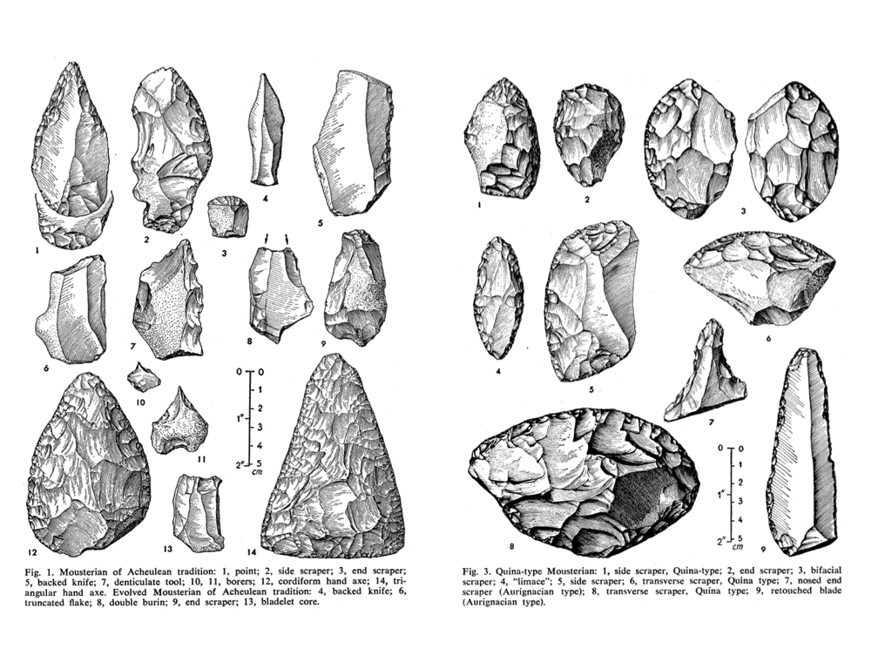

---
title:  Dissertation Final Public Oral
author: Grant Wythoff \| Columbia University
date: August 27, 2013
tags: []
abstract:
bibliography: /users/grantwythoff/documents/tex/zotero.bib
...

* * * 

# Thanks

So many people here have helped me and this document finally get to this place, that I really have to start by thanking some people for their encouragement and attention and pushback and food... everything really.

# Background

I thought I'd talk a little bit about how I came to this topic, and then give you a brief overview of a couple chapters.

When I first conceived of this project, I was interested in the historical recurrence of technological fantasies: projections of future worlds and wondrous possibilities tethered to material shifts in the fabric of the everyday present.  It seemed to me that elements of these fantasies lodge themselves in the cultural reception of new media technologies, providing a language by which we can describe and define their contours.

For instance, fantastic stories of physically "jacking in" to cyberspace in the 1980s allowed us to more concretely imagine the decentralized communities of the Internet, just as the figure of the robot became a symbol of automation in the 1940s and 50s.  Similar to research on literary science fiction, my questions would be about the mechanics of this relationship between the real and the imaginary: what elements of the given world are drawn upon, and to what extent must the fantasy resemble the reality for it to work?

From the beginning, I understood that the project had to be something more than a descriptive catalog, merely noting trends in the representation of X new technology in Y body of literature.  It was the more general problematic that I was after, an inquiry into the smallest, most elemental moments in which those fictions are generated.  But the task itself seemed too large.  Without the contours of a specific corpus on the one hand (since speculations on technological futures utterly suffuse culture, from literature to film to journalism to small talk) or on the other hand, the specificity of a particular fantasy (like communion with the dead or virtual reality), it was difficult to know where to begin.

Luckily for me, the years I attended graduate school coincided with the release of the first smartphone, the rise of the tablet as a "third category" of personal computing devices, and the emergence of mobile media that heralded new cultures of play, attention, consumerism, navigation, flirtation, and collaboration (among others).  From 2007 to 2013, gadgets have revolutionized the everyday, seemingly fulfilling some of those old technological fantasies while outstripping others entirely.

These technologies have their own rich history of dreams and anticipations, but to experience them every day is an entirely different matter altogether.  To have your friend present in the form of a soft glow of light emanating from your cupped hands on the subway, to have your location triangulated (actively and passively) by a network of low earth orbit satellites so that you never again have to worry about being lost, all of these things have been imagined before.  But what future do we imagine ourselves ushering in when we use these devices?  And, what use is the history of fictions about ubiquitous connectivity for the way the actual experience feels?

# The Argument

So, my first step was to start taking this keyword "gadget" seriously.  What initially interested me about the gadget is how the word refers to a concrete object you can hold in your hand and at the same time serves as a placeholder, a stand-in for a tool that has been forgotten, rigged up on the fly, or not yet invented. 

Unlike the more dismissive terms "gizmo" or "widget," which denote insignificant variables with no clear operational value, the gadget is an indeterminate device that is nevertheless fully operable in that it fulfills a particular set of technical and narrative functions.  It is an object that lives a curiously double life as both an actual tool and a fictional device. 

What makes the gadget an important and understudied topic in the cultural history of media technologies is the fact that its fundamental instrumentality changes from decade to decade.  Though the word "gadget" is a sort of empty container for any object whatsoever, the shape of that container changes drastically from its origins in late nineteenth century nautical jargon to its present day association with mobile media.  The functionality of the gadget is redefined for the material needs and fictional desires of each new era.

## Etymology

Originating among sailors in the 1850s as a placeholder for the name of any object that had slipped from memory, the application of the term gradually shifts to individual cogs within the complex machinery of steam ships, rather than the simple rope, pulley, or implement.

Over the next few decades, the word could refer to specific devices (as the proper name for a wire tying cotton baler, sparking interstate commerce debates in 1905 over the density versus the weight of rail cargo),

categories of devices (for instance as accessories added on to automobiles in the 1900s, airplanes and guns in the 1910s, and gramophones and cameras in the 1920s),

and characteristics of devices (signifying in the 1930s something cobbled together from preexisting materials).

By the end of the 30s, it became possible to speak of the gadget as a mode of thought or a kind of phrase.  

This history of course goes on, leading up to the contemporary connotations of *gadget* as we know it today, but suffice it to say here that

from halyards to pistons to can-openers to pagers, the wager of my dissertation is that by holding all of these diverse instances together as a set, we will be able to track a distinct evolution in the imaginative space between tools and their users.

# Overview of the Document

Okay, so here it is.  I'm going to provide you with a brief overview of the entire document, spending a bit more time on chapters Two and Four, as they anchor what's going on around them, and are representative of the two different methodological approaches I have taken throughout the project.

## Chapter 1

My first chapter introduces what's to come with a discussion of a famous archaeological debate over a group of paleolithic stone tools, manufactured by a Neanderthal culture known as the Mousterian, estimated to be anywhere between 30 and 300 thousand years old.  

These tools, all of which were excavated from the same site in the 1950s from south-west France, kicked off one of the most famous debates over the study of cultural transmission through the archaeological record.  At a time before techniques like radiocarbon dating were available, the debate centered on the question of how we can extrapolate history solely from the formal properties of a technical object.

Does the stone tool -- freshly dug out of the ground and stripped of all context -- provide information about the culture from which it emerged, or should we instead focus on the tasks to which that tool may have been put?

Using this debate as a background for current debates in media theory, I argue that the tool cannot simply be reduced to the culture from which it emerged, nor can it be understood solely through the logic of functionality.  Between the technique and the technology, there is a unique "syntax" negotiated by each of us, drawing upon the capacity to read the range of practical use off the shape of a tool, to imagine a series of possible or desirable outcomes, and to make those intangibles material.

The relationship between a tool and its affordances has been tackled from a number of angles, and I draw upon many of these approaches throughout the project.  But very few studies have been willing to take up the imaginary or speculative dimensions necessary to any instance of technical interaction.  Everyone picks up a tool in the subjunctive mood:  what does this make possible that wasn't before?  How hard do I have to swing it?  How can I apply this to my concerns?  Even, why doesn't it work?  

As I hope this project makes clear, a fuller understanding of these imaginative dimensions is important not only for the everyday tools we have at hand, but for historical and future technologies as well.  Prehistoric stone tools, dead media, and shiny new devices feel like magic because they exceed the contextual frameworks within which we would normally use them while at the same time providing a material trace of what the contours of that use might look like.

## Chatper 2

By the time we get to Chapter 2, we're ready to delve into the history of modern technology.

*Gadgetry: New Media and the Fictional Imagination* takes a hybrid approach to media history.  While much of my research is dependent on massive databases of digitized text whose breadth and accessibility would have been unthinkable even a decade ago, this portion of my project is predicated on an older, philological wager:  that words conceal tiny epistemologies, and that by tracing the etymology of this one word we can watch the evolution of a discourse on technology, on use and usability.  When we find that gadget once referred to the ropes and pulleys aboard a sailing ship and now refers to mobile media like smartphones, we immediately wonder what sort of discursive regularity might connect these very different contexts.

Chapter Two, "From Marlinspike to Mobile Media," provides an expansive critical etymology of the keyword gadget using text mining.  This chapter charts an evolving genre of tools spanning a range of literary, cinematic, social, and technical histories, including the maritime novel, domestic labor saving devices, and the transistor radio.  Assembling this genealogy of seemingly small, unnoticed things allows us to watch as the concept of the gadget is remade throughout the twentieth century.  In order to do this, I have collected and tagged as many instances of the word as possible that I have come across in online databases like Google Books, Scientific American Digital, the Corpus of Historical American English, the Making of America Collection, and the Library of Congress's Historical American Newspapers.

Focusing on a keyword as idiosyncratic as gadget (as opposed to the countless hits that would be returned for democracy or experience, for instance) allows us to take a pretty fine-grained approach.

Here are just a couple examples of how these resources allow you to interface with their data...  
    > ("portable" jumps way up between 2008 and 2012, as does "junkie") 

But rather than mapping statistical trends, I mainly focused on how people talk about and through the concept of gadgetry.

Using a simple Perl script that visualizes the prevalence of categories into which I plug each instance of the word, I was able to watch as the tools, applications, cultural contexts, and social valuations of gadgetry evolve from the 1880s to the present.  

This history cuts in and out of the chapters that follow, but my emphasis is not primarily chronological.  Instead, it assembles -- as Raymond Williams formulated it in Keywords -- a "field of meanings" useful for approaching the fictions from particular moments in this genre of tools, be it the early-twentieth-century pocket wireless receiver or the early-twenty-first smartphone.

## Chapters 3-5

The subsequent chapters take on a different methodological approach, a historically specific analysis that isn't restricted to the wide-ranging life of a single keyword.  In Chapters Three through Five, I attempt to locate a discourse outside what is delimited by the word gadget, one that is nevertheless intimately related to it.  In turning to the amateur ethos, wirelessness, and pulp fiction of early twentieth century America as my source material, I attempt to throw into relief the associations and applications that have ossified around today's everyday, digital gadgetry.  Because the gadget is both material and metaphorical, functional and fictional, we need to be able to analyze not only broad historical trends in its application but the mechanics through which new media and the fictional imagination interact, both of which -- in my view -- constitute any given device's materiality.

One argument at the core of science and technology studies is that every technology is in fact a social construction that reflects the political, cultural, and economic environments from which it emerged.  Anne Balsamo, writing on the importance of a humanities approach to the design of new technologies, argues that...

> Humanists (like us!) extend this analysis (of technology's social construction) by noting that every technology also involves the expression of cultural understandings in the form of narratives, myths, values, and truth claims. ^[@balsamo2011]

I would like to argue that on the contrary, humanists need not limit themselves to an analysis of the attendant cultural "expressions" of a technological innovation, as if these expressions could ever be merely second-order representations, untouched by the incursion of the technology itself.  The fictional imagination provides a constitutive dimension of the emergence of any given technology in the first place, down to the smallest wire or transistor.  Exploring this thesis through a range of examples forms the second half of this study.

The gadget is an object of study that, by its very nature, calls for an interdisciplinary approach able to place a wide range of technical, social, and literary histories into conversation.  In order to reconstruct the ways that users think through tools, this portion of my study draws on fields that are not often brought together, including science fiction studies, early cinema history, design studies, the history and philosophy of science and technology, and various approaches to media theory.  To situate each instance of technical interaction in its historical context, I surveyed the discourse surrounding the use of gadgetry in electrical parts catalogs, engineering diagrams for devices designed by amateur experimenters, early cinema, photographs, nascent science fiction stories, newspapers, and magazines.

### Chapter 3

In Chapter 3, I provide a case study in the circulation of a particular technical ideal: mobile communications.  Before Marconi's 1899 wireless telegraph could even print out an entirely legible message, the idea began to circulate of a portable transmitter and receiver so small that it could be carried around in the pocket.  "Pocket wireless," as it was called, remains a minor figure in media history and was quickly passed over in favor of more practical modes of communication.  But it constituted a pattern of expectation that influenced the reception of wireless telegraphy for two decades, taking on a range of material manifestations, including "baseless" speculation, prototypes showcased for the press, props and plot devices in fiction and film, and vaporware advertised alongside X-ray specs and vitamin tonics in the back of popular science and children's magazines.

### Chapter 5

In Chapter 5, "Projecting Martian Photography," I tie together several threads that have been running throughout the project concerning the fictions of science.  Taking up the first attempts to photograph the surface of the planet Mars during the height of the "canal controversy" in 1905, I explore debates on the viability of prediction and speculation that employ scientific instruments.  At a moment before the professionalization of astronomy and when amateurs contributed a great deal to scientific debates, Percival Lowell produced hypotheses by thinking beyond the limits and the specificities of the imaging instruments at hand.  "Martian photography," implying not photographs taken by Martians (though this is a topic that the chapter explores) but a counterfactual approach to scientific instrumentation, speculates on the limits of photography and the possibilities inherent to the medium.

### Chapter 4

Chapter Four, "The Fictional History of Scientifiction," pans out to examine the phenomenon of popular science publications more broadly.  Pocket wireless was a favorite topic of burgeoning popular science and experimenter magazines, which detailed its appearance in films and basement workshops alike.  One example I usually like to begin with in discussing this material is this article... 

...perhaps one of the most interesting specimens in the history of pocket wireless.

It's not the most technically original, nor is it the most imaginative in terms of the communicative scenario it projects.  However, both its designer and the circumstances of its appearance in the April 1911 issue of Hugo Gernsback's Modern Electrics merit our attention.  In the magazine's monthly "Experimental Department," where readers could submit their home-brewed designs for novel electric devices, Lewis Mumford -- author of the now-famous history of media titled Technics and Civilization (1934) -- published his first piece of writing at the age of 15:  a blueprint for a new kind of compact wireless receiver.  Flipping back three pages in the same issue, one can find the first installment of Gernsback's serial novel Ralph 124C 41+:  A Romance of the Year 2660, one of the earliest works of modern science fiction.

The proximity of this future media theorist's first piece of published writing to one of the foundational works of science fiction is no coincidence.  Lewis Mumford's early preoccupation as a tinkerer took root in a forum for the exchange of designs, components, and visions of the future.  Mumford, who would go on to have a successful career as a literary critic and associate editor of The Dial, cites these experiences among a community of tinkerers in the pages of Modern Electrics as foundational for his later theories of what he called technology's "spiritual contribution to our culture."

Modern Electrics, which began as a mail-order catalogue for exotic, imported wireless parts, gradually evolved into "A magazine devoted entirely to the Electrical Arts."  The magazine profiled international developments in new media technologies, summarized the latest U.S. Patents awarded to electrical experimenters, and solicited amateur blueprints, designs, and techniques from readers.  What sets Modern Electrics apart from other technical publications of the period like The Wireless Age and QST is the way in which its writers enlisted fiction in their attempts to find a language suited to the analysis of emerging media such as radio, television, or the more exotic osophon and telegraphone.  

For instance, when readers submitting a design encountered difficulties in describing its specifications -- perhaps a certain component was technically or economically unfeasible -- they would stitch their incomplete engineering diagrams together with narrative threads.  In a tradition that continued throughout Gernsback's later publications -- including Electrical Experimenter, Radio News, Science and Invention, and most famously, Amazing Stories (the first ever science fiction magazine) -- Modern Electrics pioneered a kind of writing that combined hard technical description with an openness to the fantastic.  It was a mixture out of which an entire literary genre emerged to tackle the question of the distinctive specificity of "medium" in a new wireless age.

Today, the phrase "science fiction" conjures up images of bug-eyed monsters, ray guns, starships, and sonic screwdrivers.  But in the opening decades of the twentieth century, before a century's accretion of images, narratives, and cliches, that which was not yet called science fiction consisted of a great number of concrete practices all geared toward a reckoning with the technological revolutions in the fabric of everyday life.  "Science," wrote Gernsback in the inaugural issue of Amazing Stories,

> through its various branches of mechanics, astronomy, etc., enters so intimately into all our lives today, and we are so much immersed in this science, that we have become rather prone to take new inventions and discoveries for granted.  Our entire mode of living has been changed with the present progress, and it is little wonder, therefore, that many fantastic situations ... are brought about today.  It is in these situations that the new romancers find their great inspiration. ^[@gernsback1927]

For Gernsback, "science" is synonymous with "applied science," an amalgam of science and technology that saw no division between the explanation of complex things and the often fantastic incursion of those things into modern life.  The paradox at the heart of Gernsback's project is that science, that supposed vehicle of enlightenment rationality, can *itself* produce enchantment and wonder.  My literary historical challenge, then, was to recover the sense of radical openness that greeted not only the basement tinkerer working through the feasibility of transmitting images over a wire, but also the author of "scientifiction" stories (as they called it then) who possessed a highly sophisticated awareness of the fact that "Two hundred years ago, stories of this kind were not possible."  Often, these individuals were one and the same, weaving together functional and fictional devices in a manner that served for them as a form of scientific discovery in itself.

# Conclusions

So that's about it!  I don't have much left to say in closing, except for a couple of brief comments on my next steps for this project.

The first involves this stuff with text mining that I showed you.

New methods in the digital humanities allow us to study literature not just as a selective canon of great works, but as an ecosystem or an economy of texts.  Now, the tools that I used were pretty rudimentary, compared to some of the analysis being done in other areas of the digital humanities.  But for me, something as simple as a keyword search and some visualization software provided me with the ability to construct my object of study from the ground up...  that is, the history of the discourse surrounding this word "gadget."

One of the implicit arguments of my opening chapters is that theories of technology and culture should engage more with the explanatory power of digital resources.  The influence of digital humanities methodologies has not yet happened among media studies communities in the same way that it has for scholars of literary history.  I have a lot more to learn in that area, but this is one way I plan on moving this project forward.

And second.  Almost all of this document focuses on media history -- constructing what I hope is a kind of foundation for the gadget as we know it today.  As I move this project into new contexts and new forums, I hope to translate this history into the present.  Today, the discourse on gadgetry is moving away from physical, material devices, and toward gestures, movements, voice commands, new ways of conceptualizing the body itself as an interface.  To me, this means more than ever that those of us working in media studies need to shift our focus away from devices and toward practices and techniques, while still maintaining a level of close, material analysis.  This is a new front for media studies in the American academy, and it's another area I'm excited to move the project into.

Okay!  I hope the project hangs together a little better in the written document than it did in this brief overview, but I do thank all of you for coming and for your attention, and would love to answer any questions.

* * *

# References