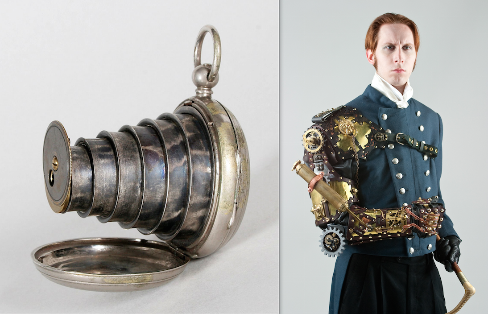
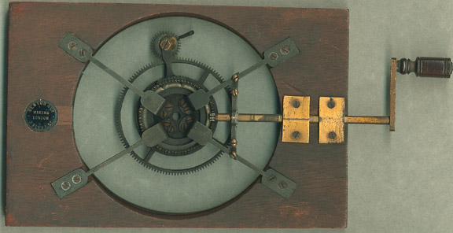
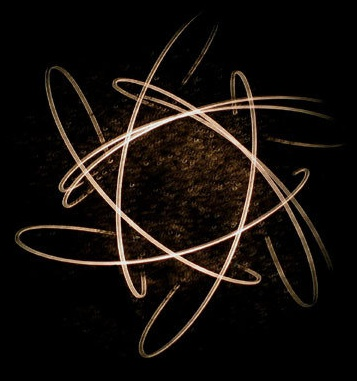

% Mobile Media and the Paleolithic
% Grant Wythoff \| Columbia University\
    \
    October 23, 2014
% Society of Fellows Lecture Series \
    \
    \
    \
    wythoff.net/paleolithic

# 

# 

# 

# 

# 

# 

# 

# 

# 

# 

# 

## 

## 

## 

# 

# 

# 

#

## 

## 

#

#

- Activities carried out around the home-based manufacturing of secondary tools and hide finishing (borers, becs, end scrapers, burins, and naturally backed knives);

- Hunting and butchering tools (points and side scrapers of all types);

- Food preparation (backed knives, naturally backed knives, end notched pieces, typical and atypical Levallois flakes and retouched blades);

- Processing of plant material (denticulates and notched tools, scrapers with abrupt retouch, raclettes, truncated flakes); and

- Specialized hunting and butchering (elongated Mousterian points, discs, scrapers on the ventral surface, typical burins and unretouched blades).

# 

#

“Archaeologists tacitly assume that artifacts, regardless of their functional context, can be treated as equal and comparable ‘traits.’  Once differences and similarities are ‘defined’ in terms of these equal and comparable ‘traits,’ interpretation proceeds within something of a theoretical vacuum that conceives of differences and similarities as the result of ‘blending,’ ‘directional influences,’ and ‘stimulation’ between and among ’historical traditions’ defined largely on the basis of postulated local or regional continuity in the human populations.  I suggest that this undifferentiated and unstructured view is inadequate, that artifacts having their primary functional contexts in different operational sub-systems of the total cultural system will exhibit differences and similarities differentially, in terms of the structure of the cultural system of which they were a part.”

Binford, “Archaeology as Anthropology,” 217-18

#

# 

"Techniques involve both gestures and tools, sequentially organized by means of a 'syntax' that imparts both fixity and flexibility to the series of operations involved.  This operating syntax is suggested by the memory and comes into being as a product of the brain and the physical environment."

Leroi-Gourhan, *Gesture and Speech*, p. 114

# 

# 

# 

#

#

"Over the past few years I've had an uncomfortable sense that someone, or something, has been tinkering with my brain, remapping the neural circuitry, reprogramming the memory. My mind isn't going--so far as I can tell--but it's changing. I'm not thinking the way I used to think."

Nicholas Carr, "Is Google Making Us Stupid?"

#

"…it is an attribute of the Internet to activate in me, and maybe in all its users, a persistent sense of deferred expectancy, as if that thing that I might be looking for, that I couldn't name but would know if I saw, were at every moment a finger tap away."

Sven Birkerts, "The Room and the Elephant"

# 

# 

#
##

## 

## 

## 

## 

## 

## 

## 

## 