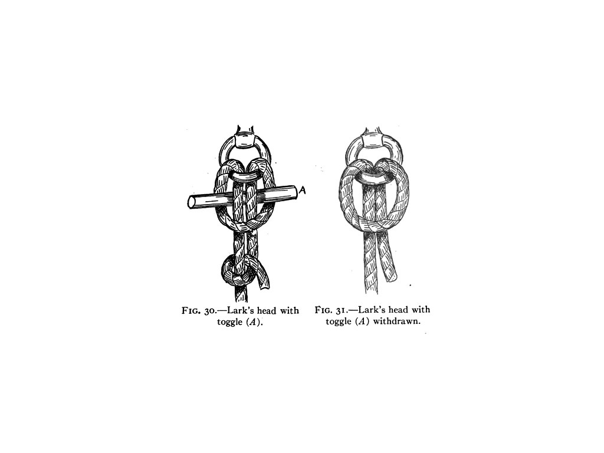
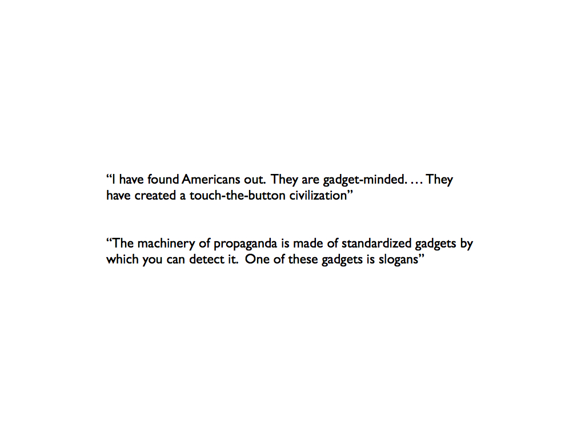

---
title:  From Marlinspike to Mobile Media:\ An Archaeology of the Gadget
author: Grant Wythoff \| Columbia University
date: November 14, 2013
bibliography: /users/grantwythoff/tex/zotero.bib
...

* * * 

# Introduction & Overview

...as . . . indicated, I work in media studies and the digital humanities.  All you really need to know as background for this presentation, is that I'm interested in *technique*, that slippery negotation between a user and a tool, as an object of cultural study.  

My book in progress, currently titled *Gadgetry: New Media and the Fictional Imagination,* 

The idea is to produce a history what is more or less a *genre* of technology that includes both actual tools you can hold in your hand and perform certain actions with (we can look around this room right now, or root through our pockets, and come up with some tools that we understand to be gadgets), but this genre includes fictional devices as well:  the word can serve as a kind of placeholder for a tool that hasn't been invented yet, or is entirely fantastic.  The gadget is an object that lives a curiously double life as both a functional and a fictional device.

* * *

so, important for me here is the history of science fiction, and the ways that literary authors have narrativized technologies, but also the flip-side of this equation, moments of so-called "science fictionality" in everyday life -- when something becomes so new or foreign you lack the ability to contextualize what's happening.

* * *

This is exciting to me precisely because media studies, a field whose domain is supposed to be the intersections of technology and cultural form, has proven pretty clumsy when it comes to articulating a relationship between these two elements that isn't entirely deterministic:  Poetry *reacts* to the new experiences of speed in technological modernity rather than producing new experiences in its own right; game designers build levels based on the affordances and limitations of the platforms they're designing for, rather than pushing engineers to rethink those platforms and interfaces.

In this talk, I'll basically be working through some methodological groundwork for the project as a whole.

This talk has three parts.  We're going to begin a little far afield, with a famous archaeological debate over a group of paleolithic stone tools made by a Neanderthal culture.  The debate centers on the kinds of information that can be inferred solely from the formal properties of a technical object.  Does the stone tool -- freshly dug out of the ground and stripped of all context -- provide information about the culture from which it emerged, or should we instead focus on the tasks to which that tool may have been put?

This debate will provide us with some background for current conversations in media theory on the relationship between tools and their affordances.  In [Part 2](#evolution), I will introduce several approaches that have emerged over the past few years either to examine the ways that media *determine* particular courses of action or modes of thought, or to produce alternative models whereby culture and technology interact on a more level playing field.

Finally, we'll close with a brief overview of my 

This is the first time that I've presented most of this material -- a lot of my ideas have been locked up in the language I'm about to read, so I'm very much looking forward to everyone's feedback.

# Technology and Technique in the Mousterian Debate

Illustrated here are two groups of stone tools manufactured by a Neanderthal culture known as the Mousterian, estimated to be anywhere between thirty and three-hundred thousand years old.  The group of tools on the left includes heart-shaped handaxes, knife edges with smoothed hand holds, a number of small borers made of flint, and ridge-faced scrapers described as "denticulate" for their tooth-like structure.  On the right, we have a greater number of side-scrapers with a single working edge, a more uniform style of retouching that resembles overlapping fish scales, and a painstakingly formed blade usually associated with the later industries of anatomically modern humans.  These tools, all of which were excavated in the 1950s from the same site in the southwest of France, occasioned one of the most famous debates over the study of cultural transmission through the archaeological record.  At a time before the development and influence of chronometric techniques like radiocarbon dating that would allow later paleoarchaeologists to definitively order these artifacts in time and space, the Mousterian debate centered on the question of how we can extrapolate history from the formal properties of a technical object.

For Francois Bordes, formal differences in stone artifacts are evidence of distinct cultures that held shared traits.  In classifying groups of tools with shared morphological characterisitcs (the above representing only two of the four groups in his taxonomy), archaeologists could identify unique populations that existed at different moments in time.  Thus, in this "phylogenic interpretation" of artifacts, technology provides evidence of the cognitive evolution of the human species.

An incredibly interesting figure for many reasons: Bordes also introduced: "statistical studies in typology" (wikipedia), experimental archaeology like reproducing flintknapping, and was a science fiction author!

Bordes's approach to the Mousterian artifacts was revolutionary, as it was one of the first that rejected teleological models of evolution moving from the simple to the complex.  His taxonomy of the Mousterian industry showed that there was no definitive "progress" from one group of stone tools -- and thus cultural groups -- to the other, with some complex artifacts preceding cultures that manufactured simpler stone tools.

At the same time, Bordes's direct mapping of technological evolution onto biological evolution unseated the importance of anatomically modern humans and their emergence in the archaeological record by showing the great diversity and complexity of Neanderthal cultures, a species whose cognitive capacities were previously thought to be relatively elementary.

For the younger American archaeologist Lewis Binford, whose work is associated with the "Processual" or "New Archaeology" movement of the 1960s, Bordes's phylogenetic approach took far too many liberties in extrapolating definitive cultural characteristics from the morphology of artifacts.  Instead, Binford encouraged a far more pragmatic approach, one focused on the functions that each of these tools might have served.  Binford's interpretation was based on a processual understanding of culture: an unfolding negotiation of groups, artifacts, and environments rather than a static set of shared traits.

Defining culture as "an exosomatic means of adaptation for the human organism," Binford is here not far from Bernard Stiegler's increasingly influential theorization of technics as "a process of exteriorization, [...] the pursuit of life by means other than life."

Binford's "functional interpretation" saw tools as adaptive markers that existed in complex relationships with new environmental demands and changes in social organization.  Denticulate tools used for butchering animal carcasses or side scrapers for shredding plant materials might take on a different form when a population encountered a new species moving into their region.  Similarly, if that group experienced an environmental change or migrated to a different terrain, they may have to fashion their tools out of very different raw materials.  Thus, in Binford's functional interpretation, the types of histories one can infer from the paleoarchaeological record are manifold.

The mousterian debate reveals the complexity of how we narrate the many lives of technology: the tasks to which are tools are put, the expanded ranges of action and forms of expression they enable, the cohesion and succession of sociocultural traditions, and how we resurrect such forms of subject-object interaction from history.  Bordes provided a model by which we can begin to think about successive paradigms of techn-ology in its most literal sense -- as a thinking on and through tools -- while Binford's approach encouraged a historicist acknowledgement that everything we know about the past of tool use is based on extrapolation, especially when it comes to prehistory.

Of course, these questions of interpretivism have since been simplified by chronometric techniques that lend greater accuracy to the dating of objects.  Bordes and Binford wrote just before the development and influence of radiocarbon dating, which allowed later paleoarchaeologists to definitively order their artifacts in space and time.  Unless researchers like Bordes and Binford extracted paleolithic tools from neatly stratified layers in the sediment, thus lending some sort of temporal order (which was exceedingly rare), they strung artifacts together in a historical sequence by extrapolating from form.

But to say that radiocarbon dating effectively solves the Mousterian debate by allowing the paleoarchaeologist to declare that, in fact, this side-scraper is exactly 43,000 years old, is to overlook the material vicissitudes of extracting a technical object from the sediment and abstracting it from all of its Heideggerian involvement-relationships.

Herein lies the importance of understanding the technical object not just as a tool, but as a complex of traces revealing the preferences, routines, and styles that form the basis of individual and social behavior.  In extracting and abstracting these artifacts, we experience what Wolfgang Ernst described as "the hard-edged resistance of material objects that undo historical distance simply by being present."  No matter how finely tuned the scientific instrument, the accuracy of archaeological evidence is always inflected by "the human eye, confronted with an irritating material presence of the past, which by definition should be absent, \[a situation that]\ immediately confounds evidence with magic."

Magic, when it is spoken of in relation to technology, usually implies a kind of awe in the face of inscrutable complexity.  According to Arthur C. Clarke's so-called third law, "any sufficiently advanced technology is indistinguishible from magic."  But it is important for us to remember that there is a very different form of magic about tools as simple as the denticulate side-scraper, one that has everything to do with legibility.  These artifacts compel speculation on the irremediable texture of habits and techniques that have long since been forgotten or absorbed into other forms of technical expertise.  Despite their alien appearance and their improbable survival from a world so different from our own, these tools (like any other) almost seem to reach out and grasp us, whispering of how they are to be used.  This is what we might call technology's ontological magic: how we come to understand what a tool is and what it's good for.

While the Mousterian debate reveals what's at stake when thinking about technology, I want to suggest that it also dramatizes what it is to think *through* technology.  There is something of this paleoarchaeological magic evoked every single time we pick up a tool.  A delimited set of affordances branches off from the contours of the individual tool (such as torque, storage, amplification), but it is never enough to simply begin and end here.  This means-ends model must always unfold into a range of preferences, routines, traditions, and styles.

Thus, the dialectic at the core of the Mousterian debate -- between cultural tradition or functional adaptation, technology and technique -- is played out in the ways we think through a problem using the grammar of potential solutions, whenever we decide to push or pull, attempt to decipher a manual, or prepare to teach a new method.

The "operational sequence" of any technical interaction, as the French archaeologist Andre Leroi-Gourhan calls it, consists in an assemblage of material and non-material components:

> Techniques involve both gestures and tools, sequentially organized by means of a 'syntax' that imparts both fixity and flexibility to the series of operations involved.  This operating syntax is suggested by the memory and comes into being as a product of the brain and the physical environment.

In this sense, the precise contours of technical interaction have the potential to be wholly unique every time, with each instantiation of a particular technology or technique being subject to an alchemical mixture of cultural determinants and individual predispositions.  The tool cannot simply be reduced to the culture from which it emerged, nor can it be understood solely through the logic of functionality.  Between the technology and the technique, there is a unique "syntax" negotiated by each of us, drawing upon the capacity to read the range of practical use off the shape of a tool, to imagine a series of possible or desirable outcomes, and to make those intangibles material.

But if we continue in this vein, following Heidegger's insight that "the essence of technology is by no means anything technological," what then should constitute our object of study?  Does a handaxe crafted from a previously prepared stone core constitute a technology or a technique?  \[maybe explain Levallois technique here\]  What about a telegraph key designed to be grasped in the palm, its sounder struck with the thumb?  Or a touchscreen that allows a pinching gesture to be translated into a change in the size of a digital image?

The relationship between a tool and its affordances has been tackled from a number of angles, and several of these approaches will be drawn upon in what follows.  But very few studies have been willing to take up the imaginary or speculative dimensions necessary to any instance of technical interaction.  Everyone picks up a tool in the subjunctive mood:  what does this make possible that wasn't before?  How hard do I have to swing it?  How can I apply this to my concerns?  Even, why doesn't it work?

As I hope it will become clear, a fuller understanding of these imaginative dimensions is important not only for the everyday tools we have at hand, but for historical and future technologies as well.  Prehistoric stone tools, dead media, and shiny new devices feel like magic because they exceed the contextual frameworks within which we would normally use them while at the same time providing a material trace of what the contours of that use might look like.  In this way, technical literacy evokes specters of the past and the future.  In order to track down the poetics of imagining and imaginary solutions, I would like to proceed inductively, taking my cue from the evolution of a particularly appropriate genre of technology: the gadget.

* * * 

this last line makes it seem like I could do this to *any* genre of technology.  end more abruptly, if this is going to be a set of theses or explanations)

* * * 

# Evolution of Technology {#evolution}

The idea that changes in technology can help us to register evolutionary shifts in cognition has begun to enter popular consciousness, thanks to contemporary conversations on gadgetry.  While it once referred to the small, the trivial, or the indeterminate, today, the word gadget is almost entirely associated with digital media and portable electronics:  technologies that are seen to have momentous effects on social life and cultural production.  Gadgets like smartphones, tablets, and GPS receivers, say the pundits, are fundamentally altering the ways we read, communicate, and even think.

This shift has ramifications for logic:

> Over the past few years I've had an uncomfortable sense that someone, or something, has been tinkering with my brain, remapping the neural circuitry, reprogramming the memory.  My mind isn't going -- so far as I can tell -- but it's changing.  I'm not thinking the way I used to think. (@carr2008)

For memory:

> The medium has created an unremitting low-intensity neural disquiet that we feel only the medium can allay -- even though it cannot, never has.  But it is an attribute of the Internet to activate in me, and maybe in all its users, a persistent sense of deferred expectancy, as if that thing that I might be looking for, that I couldn't name but would know if I saw, were at every moment a finger tap away. @berkerts2011

and even spatial reasoning, according to a recent editorial in *The New York Times* by the cognitive scientst Julia Frankenstein, who reports that the nature of spatial interactions -- whether mediated through verbal directions, a map, or GPS technologies -- physically alter brain structures.@frankenstein2012

Douglas Copuland, who produced the above image for an art installation, writes in his book on Marshall McLuhan:

> Somewhere around 2003 the texture of daily life inside Western media-driven societies began to morph, and quickly, to the point where, a half-decade [now decade] later, it's obvious to people who were around in the twentieth century that time not only seems to be moving more quickly, but is beginning to feel *funny* too.  There's no more tolerance for waiting of any sort.  We want all the facts and we want them *now.*  To go without email for forty-eight hours can trigger a meltdown. . . . All this information and more has overtly, osmotically, or perhaps inadvertently damaged a collective sense of time that has been working well enough since the Industrial Revolution and the rise of the middle classes. . . . The voice inside your head has become a different voice.  It used to be 'you.'  Now your voice is that of a perpetual nomad drifting along a melting landscape, living day to day, expecting everything and nothing. (7-9)

This last decade has seen the release of the first smartphone, the rise of the tablet as a "third cateogry" of personal computing devices, and the emergence of mobile media that heralded new cultures of play, attention, consumerism, navigation, flirtation, and collaboration (among others).  Gadgets have seemingly revolutionized the everyday, fulfilling scores of old technological fantasies while outstripping others entirely.

**need transition here, how new movements in media theory are harkening back to models of historical paradigm shifts**

This approach may sound familiar to those who have been following recent attempts in media studies to answer questions about how technology "evolves."  After decades of denigrating the metanarratives of (among others) Marshall McLuhan, Lewis Mumford, and Vilem Flusser -- theorists who sought to construct a deep history of technological paradigm shifts, each of which culmiated in projective futures of the global village, or the neotechnic phase, or the telematic society -- models of evolutionary epistemology have begun to creep back into theories of media and technology.

Excavational metaphors abound in digital media studies, an emerging field that encompasses both the study of digital technologies as well as their application in the service of humanities research: scholars speak of media archaeology, data mining, the "forensic imagination," and "visualizing the nineteenth century literary genome."  Man the Toolmaker, a notion prevalent among paleoarchaeologists in the mid-twentieth century that connected the emergence of the human with the beginnings of tool use (hence Mary and Louis Leakey's naming of homo habilis, or "handy-man", in distinction to homo sapien, or "knowing human") has taken on a new significance in the age of digital media and mobile computing.

As a means of assessing the changes wrought by new technologies, it has led to a resurgence in the concept of technogenesis among media theorists:  the idea that hominds have co-evolved with tools in a highly complex feedback loop between the biological and the technical.  For proponents of the theory of technogenesis,

> it is impossible to define the human as either a biological entity (a body or species) or a philosophical state (a soul, mind, or consciousness),  because our 'nature' is constituted by a relation to technological prostheses. (@bradley2006, 78)

As David Wills writes,

> there is technology as soon as there are limbs, as soon as there is any articulation at all.  As soon as there is articulaiton, the human has rounded the technological bend, the technological turn has occurred, and there is no more simple human.  Which, for all intents and purposes, means that there was never any simple human. (@wills2008, 5-6)

While many proponents of technogenesis write on the scale of tens of millennia, others espouse the theory as a way to speak to the specificities of the digital.  Some media theorists take the evolutionary model quite literally, as does Katherine Hayles in her book *How We Think: Digital Media and Contemporary Technogenesis*, where she writes of "the changes in human attitudes, assumptions, and cognitive modes associated with digital media."  But if the digital revolution not only recapitulates the evolution of technology but intensifies it, as Hayles would have it, the question becomes:  is it possible for an individual to actually feel the pressure of evolutionary change?  Can what previously occupied vast swaths of evolutionary time now be condensed into the life of an individual organism, or even further, a particular moment of technological interaction?

On one leve, the answer is: certainly not.  No one fully understands the mechanism behind the divergence of modern humans from species who didn't use tools, and any attempts to understand what the next great evolutionary leap may be (or has been) -- such as Leroi-Gourhan's amazing ruminations in 1962 on the links between the rise of automation and "audiovisual media" -- are of course speculative at best.  Moreover, many media theorists writing on the idea of technogenesis in relation to contemporary media technologies employ ideas that are highly contentious and even completely outmoded among paleoarchaeologists today.  For instance, many proceed from the starting point that it was the emergence of bipedalism that first allowed tool usage, citing a line of Darwin's speculating that walking upright freed the hands to manipulate objects and carry food over a long distance.  This idea is not only problematic because it is now generally accepted that our hominid ancestors were bipedal millions of years before they began making tools, but because tools have been observed in use with a wide variety of non-bipedal animal species, including chimpanzees, who have been shown by primatologist Andrew Whiten to possess "the capacity for cultural transmission."  In his words, "experimentally introduced technologies will spread within different ape communities," and individua chimpanzees show "a capacity to acquire local variants of the technique."  Research on the cultures of animal tool use significantly complicate claims that technology marks the distinctive specificity of the human.

**do i risk some kind of cultural essentialism here? anthropological racism, even?  Perhaps say something here about technology gap / usage gap as yet another reason conversations of an evolutionary leap are dangerous**

And yet on another level, there is something to the idea that an encounter with a new technology causes an immediate reorientation in the ways we make sense of the world.  The technophiles of today frequently remark that touching the latest Apple product is like "holding the future in your hands,"

as if the iPhone were the next iteration of the *2001: A Space Odyssey* monolith: a sleek black box whose inner workings we couldn't possibly understand but at the same time, somehow, makes us smarter the instant we touch it.  In this mythical explanation of human origins that falls into the gap of Kubrick's famous match cut from the bone club thrown into the air to the spaceship gracefully floating through outer space, we are simply remade by the tool the moment what might be done with it becomes clear.

Setting aside questions of cognition and neurophysicology, I am interested in finding a language for this kind of fictive energy so that we might be able to register and historicize the perceived pressures of technological change.  Despite the fact that we cannot say in any sense whether we are biologically "evolving" with digital media, a deeper history of gadgetry will allow us to track an evolution in the imaginative dimensions constitutive of all technical interaction.

* * *

**here's an overview of some relevant approaches to the epistemology of technology, many of which descend from approaches in the German academy.  American approaches to media studies tend to emphasize culture and content...**

## Cultural Techniques

Epistemologies of media technology have been taken up from a number of different angles.  Contemporary German media theorists, working off Friedrich Kittler's decisive pronouncement that "media determine our situation," are developing conceptual vocabularies to describe the space between technology and the subject.  One conversation revolves around the idea of Kulturtechniken, or the underlying "cultural techniques" that are older than the theories or systems that are eventually generated from them.  For instance, people made marks before there was an alphabet, and individuals sing or hum before they have any notion of musical notation.  Bernhard Siegert writes:

> The concept of cultural techniques is vehemently opposed to any ontological usage of philosophical terms: Man does not exist independently of cultural techniques of hominization, time does not exist independently of cultural techniques for calculating and measuring time; space does not exist independently of cultural techniques for surveying and administering space; and so on.

## Mediengebrauche

Another approach emphasizes an attention to Mediengebrauche, or particular "media usages" (e.g. to compile, to skim, to arrange, to watch, to like) rather tha nproceeding from categories of media as defined by their contents, or from self-evident media historical epochs.

## Media Archaeology

Media archaeology is another approach with roots in the American academy, one that is beginning to gain traction in the U.S.  Far from the stones and bones of paleoarchaeologists, this  field of media research takes its cue from the "archaeology" of Foucault, with its critique, or discourse analysis, of the systems of power behind cultural forms.  For media archaeologists, uncovering forgotten curiosities from media history provides a unique vantage point on contemporary media cultures.  Media archaeology is a historiographic movement that seeks to branch out from the traditional canon of media history (i.e. from book to phonograph to cinema to television to the Internet) in order to catalogue and make visible the forgotten paths and curiosities from the history of interaction, speculation, research and development.  Here, objects like punch cards, magic lanterns and other optical toys, corporate technical reports, and even revolving doors take center stage.  In this sense, media archaeology is not merely a call to do better history, or even to revise the canon of historical objects.  Rather, as a distinct method, it has the effect of creating unexpected correspondences between habitual and historical media.

## Platform studies

Another sympathetic area of inquiry can be found in Platform Studies, which started with an MIT Press book series edited by Ian Bogost and Nick Montfort.[40]  By focusing on the "underlying computer systems and how they enable, constrain, shape, and support the creative work that is done on them," scholars in platform studies contend that "it is time for humanists to consider seriously the lowest level of computing systems, to understand their relationship to culture and creativity."[41]  The books published in the series so far are specific to gaming, with titles on the Atari, Nintendo Wii, and the Commodore Amiga.  

The work of all the above scholars informs and inspires my own study.  In analyzing the cultural history of the gadget, I hope to contribute to this larger and incredibly dynamic body of scholarship on the relationship between technology and cultural form in the age of digital media.  It is with my particular focus on the imaginary that I hope to enrich the ongoing conversation.  Scholars like Jussi Parikka and Eric Kluitenberg have written on what they call "imaginary media," a category that, in my view, deserves much further elaboration.[42]  The imaginary is always embedded within a "network of material practices," as Kluitenberg puts it, and in Parikka's historical observation on the turn of the twentieth century, "the new world of science and technology was the imaginary that was often most easily affiliated with the dead, with ethereal communication between brains, and with understanding the new through such metaphoric transitions."[43]  But the precise relationship between the material and the imaginary, the circuits connecting them on the most elemental of levels, has yet to be fully explored in scholarship on media technologies.  For me, this entails a radical rethinking of what it is to use media, an activity intimately related to the the individual's imagination of -- quite simply -- making and acting.  While Kluitenberg and Parikka advocate the analysis of the imaginary on the level of vast, discursive fantasies (like telepathy and communion with the dead), I will attempt to show how "the imaginary" is every bit a product of an individual subject's experience with an individual tool, with all of the complications that those terms entail.

The turn I want to make here to classical archaeology (paleoarchaeology in particular), is meant to emphasize that any approach to the historiography of media cannot merely devolve into a collection of forgotten curiosities and thus a better, more complete form of history.[44]  Instead, paleoarchaeology gives itself over to inference, to potentialities not readily available on the surface by extrapolating history from typology, by "defining the position of each element in relation to the other elements in the series," as Foucault puts it in one of his definitions of archaeology.[45]  Technical artifacts takes on a variety of forking paths, potential lives that branch off from the individual tool.  Further, these tools are treated not merely as self-sufficient pieces of evidence, but as ideational units, imaginative products of the mind and culture that produced them.  In this way, we will of course be exploring not merely fictions about particular technologies, but the constitutive fictionality of technology itself -- the way in which any technical interaction compels imaginative thought.  Paleoarchaeology's "epistemological reverse engineering"[46] of human tool use mirrors the very process it seeks to uncover:  we hold a tool and attempt to think through the contours of what it affords.

While media studies has classically been interested in large scale materiality -- broadcast networks, representational frameworks, content delivery systems, power structures, transnational flows -- the emergent approaches summarized above indicate a renewed attention to materiality as a process, negotiated on the smallest of scales.[47]  The ongoing debate in paleoarchaeology over how to interpret technical artifacts remains instructive for theorists of media.  What is the unit of analysis we are are interested in:  the technical artifact or the ideational unit that it symbolizes?  The inner structure of that artifact or the web of practices, actors, and materials that it draws together?  Hewing closely to the contours of the gadget as an object of study, I want to ask: what would a media theory of interaction look like, one in which materiality encompassed the mediation between an individual subject and object, user and tool?[48]  What can we read off the shape of the individual artifact:  a distinct culture, unique in space and time, or the uses to which that tool can be put, with all that such usage entails?  While thus far media archaeology seems to privilege the history of vast social and technical apparatuses, a paleoarchaeology of media does not focus exclusively on the artifacts constituting these epistemes but on their techniques as well.  These techniques include not only the technical work process to which a given tool is put, but the ideas behind technologies -- fictions or memes of their efficacy, a subjunctive realm that for Leroi-Gourhan has every bit as much to do with operational sequences as do the tools themselves.  Throughout this project, I will demonstrate how fictions -- broadly understood -- play a constitutive role in the emergence of new media as socially shared systems of communication and expression.

# Today

**these paragraphs now transition from evolution and digital media stuff to why looking at the gadget is a useful means of looking at this topic**

Over the past ten years, the everyday has seemingly been revolutionized...  but what does any of this have to say about how these experiences actually feel?  cupping a soft glowing light in your hands on the subway...

I do think we should take this proposition -- that gadgets are causing us to evolve -- *at its word.*  But it's a proposition that makes sense not because digital media have come down from on high in order to alter the nature of human cognition.  Instead, I want to emphasize how a deeper history of gadgetry -- a category that has encompassed tools, techniques, and ideas -- provides a menas to register shifts in the evolving ways we think with technology.  The versatile gadget ("What an odd little word 'gadget' is, almost a gadget in itself, so small and useful," writes Vita Sackville-West) has been applied throughotu the twentieth century not only to specific tools, but to modes of manufacture, forms of expertise, imaginary machines, styles of problem solving, and fictional devices.  To speak then of the history of gadgetry is not merely to turn our attention to the small, seemingly trivial objects that the more distinguished lineages of material culture studies and the history of technology have systematically passed over; it is to isolate those dimensions that evolutionary trees and archaeological layers cannot convey.

What makes the gadget an important and understudied topic in the cultural history of media technologies is the fact that its fundamental instrumentality changes from decade to decade.  Though the word "gadget" is a sort of empty container for any object whatsoever, the shape of that container changes drastically from its origins in late nineteenth century nautical jargon to its present day association with mobile media.  The functionality of the gadget is redefined for the material needs and fictional desires of each new era.

Originating among sailors in the 1850s as a placeholder for the name of any object that had slipped from memory, the application of the term gradually shifts to individual cogs within the complex machinery of steam ships, rather than the simple rope, pulley, or implement.

Over the next few decades, the word could refer to specific devices (as the proper name for a wire tying cotton baler, sparking interstate commerce debates in 1905 over the density versus the weight of rail cargo),

categories of devices (for instance as accessories added on to automobiles in the 1900s, airplanes and guns in the 1910s, and gramophones and cameras in the 1920s),

and characteristics of devices (signifying in the 1930s something cobbled together from preexisting materials).

By the end of the 30s, it became possible to speak of the gadget as a mode of thought or a kind of phrase.  

This history of course goes on, leading up to the contemporary connotations of *gadget* as we know it today, but suffice it to say here that

from halyards to pistons to can-openers to pagers, the wager of my dissertation is that by holding all of these diverse instances together as a set, we will be able to track a distinct evolution in the imaginative space between tools and their users.

* * *

# References