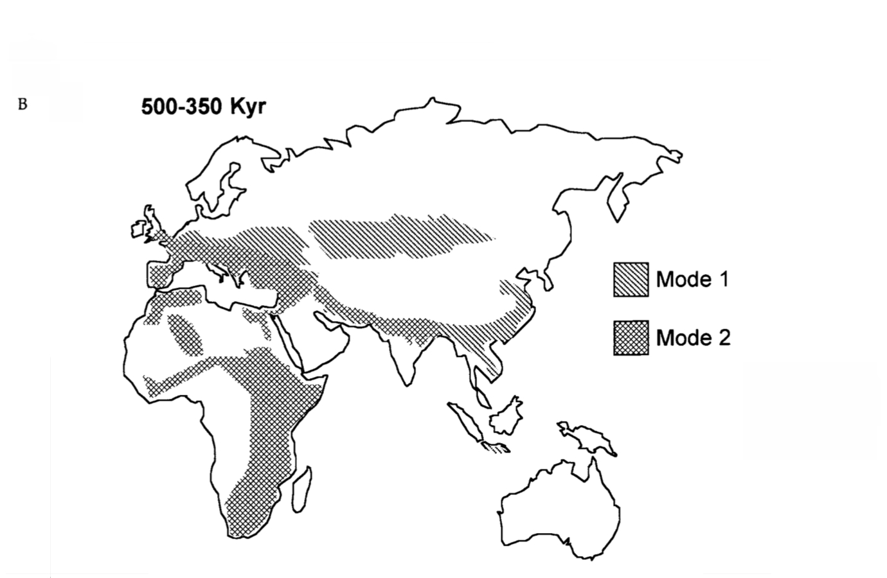
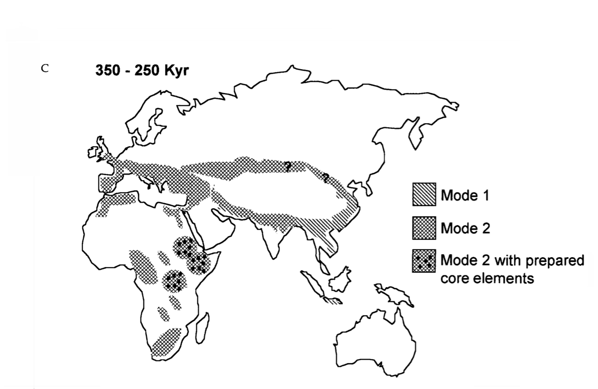
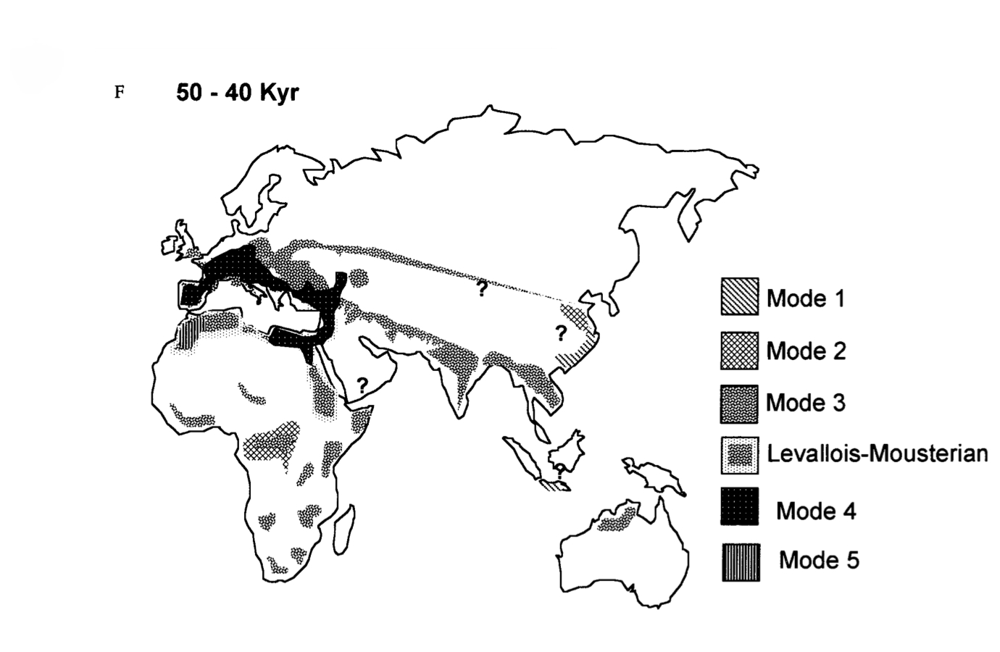
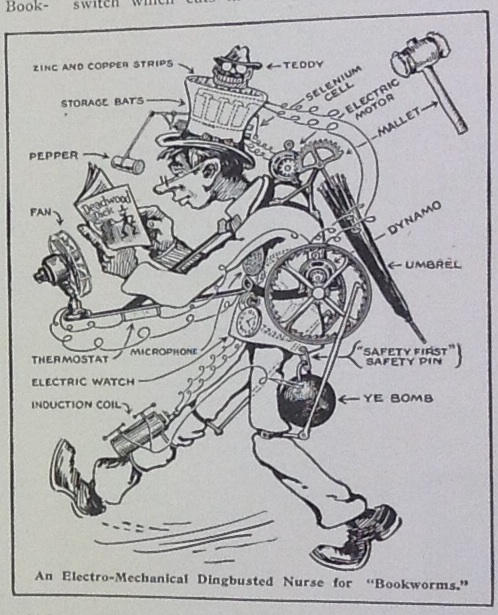

% Mobile Media and the Palaeolithic
% Grant Wythoff \| Columbia University\
    \
    September 4, 2014
% Archaeologies of Media and Film \
    Bradford\
    \
    \
    \
    wythoff.net/bradford

# 

# 

"Techniques involve both gestures and tools, sequentially organized by means of a 'syntax' that imparts both fixity and flexibility to the series of operations involved.  This operating syntax is suggested by the memory and comes into being as a product of the brain and the physical environment."

Leroi-Gourhan, *Gesture and Speech*, p. 114

#

"Over the past few years I've had an uncomfortable sense that someone, or something, has been tinkering with my brain, remapping the neural circuitry, reprogramming the memory. My mind isn't going--so far as I can tell--but it's changing. I'm not thinking the way I used to think."

Nicholas Carr, "Is Google Making Us Stupid?"

#

"…it is an attribute of the Internet to activate in me, and maybe in all its users, a persistent sense of deferred expectancy, as if that thing that I might be looking for, that I couldn't name but would know if I saw, were at every moment a finger tap away."

Sven Birkerts, "The Room and the Elephant"

# 

# 

#
##

## 

## 

## 

## 

## 

## 

## 

## 

## 

## 

## 

## 

## 

## 